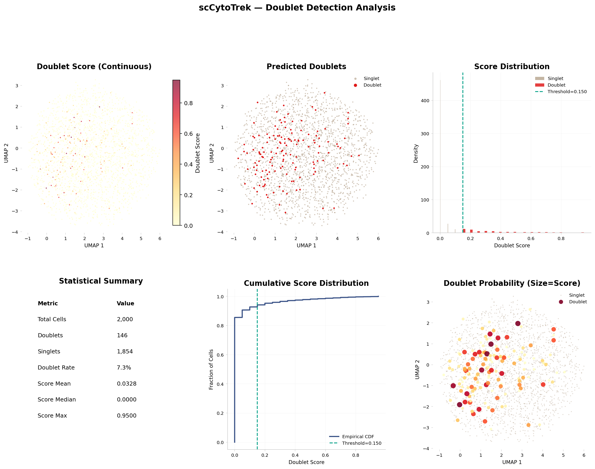
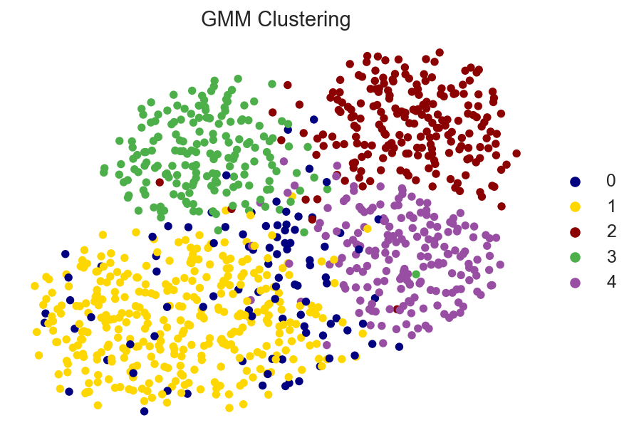
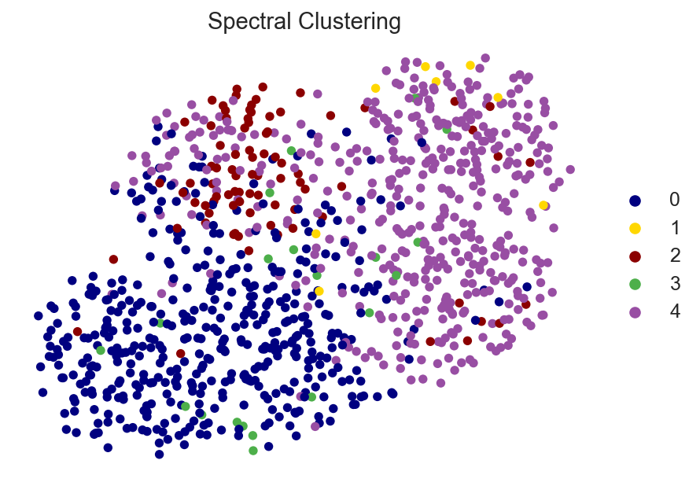
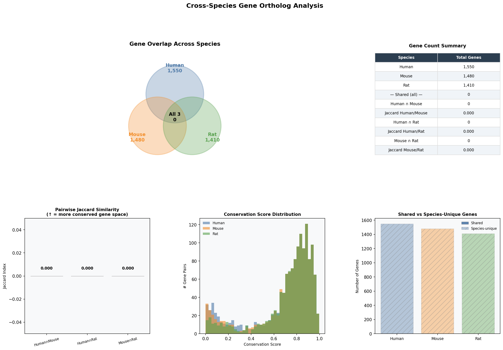
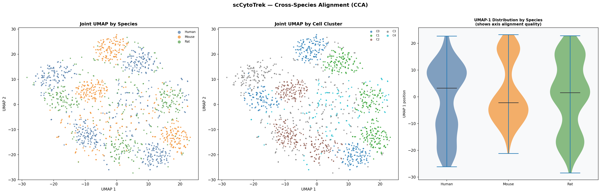
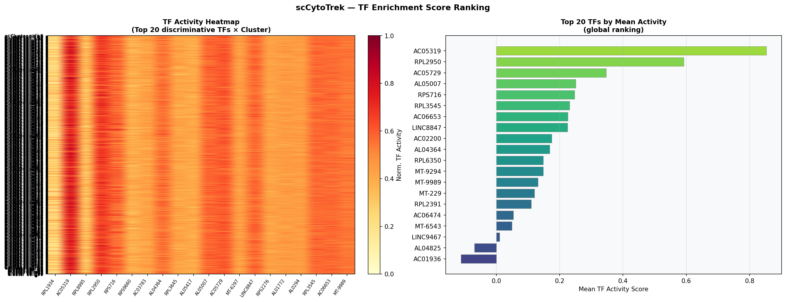
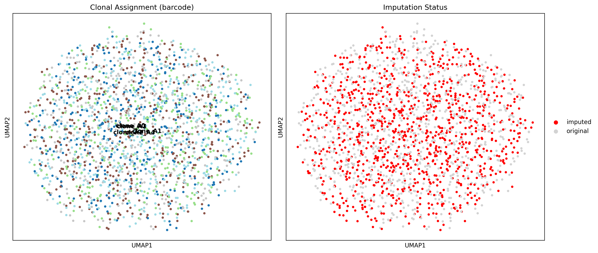
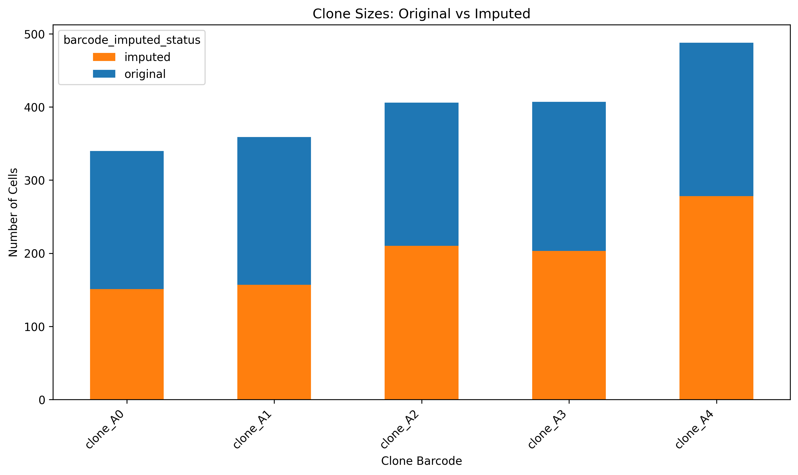

# scCytoTrek 🚀

**scCytoTrek** is a comprehensive, scalable, and multi-functional Python package specifically designed for advanced single-cell and multi-omic data analysis. Built on top of `anndata` and `scanpy`, scCytoTrek minimizes external dependencies by providing custom, tailored algorithms for a wide variety of analytical workflows.

It is designed to give researchers deep insights into cellular heterogeneity, trajectory dynamics, cell-cell communication, and regulatory networks.

---

## 🌟 Key Features & Modules

scCytoTrek is organized into distinct functional modules:

### 1. Preprocessing (`sccytotrek.preprocessing`)
- **Fast Cell Subsampling:** Downsample massive datasets while preserving cluster diversity.
- **KNN Imputation:** Advanced k-nearest neighbors smoothing to recover lost signal from dropout events.
- **Robust QC & Normalization:** Standard single-cell QC wrappers integrated smoothly.

### 2. Tools & Analysis (`sccytotrek.tools`)
- **Custom Doublet Identification:** Detect artificial doublets using PCA-based neighborhood density (no generic dependencies required).
- **Dropout-Adjusted Differential Expression:** Perform DE analysis while correcting for varying cellular capture efficiencies (Cellular Detection Rate - CDR).
- **Confounder Regression:** Remove technical batch effects or uninteresting covariates directly from the expression matrix.
- **Cell Type Identification:** Score and assign biological cell types based on known marker gene lists.
- **Clinical Survival Correlation:** Integrate scRNA-seq expression with patient survival data using Lifelines.

### 3. Advanced Clustering (`sccytotrek.clustering`)
- **Non-Negative Matrix Factorization (NMF):** Discover additive, interpretable gene expression programs (meta-genes).
- **K-Means:** Rapid quantization for massive datasets or highly distinct, globular clusters.
- **Agglomerative (Hierarchical):** Uncover evolutionary or developmental hierarchies holding sub-lineages.
- **Spectral Clustering:** Identify non-convex and continuous manifold structures where K-Means fails.
- **Gaussian Mixture Models (GMM):** Model continuous differentiation bridges using soft-probabilistic cell assignments.
- **DBSCAN:** Density-based clustering, perfect for spatial data and isolating outlier/noise cells.

### 4. Trajectory Inference & Tipping Points (`sccytotrek.trajectory`)
- **Pseudotime Inference:** Automated wrappers for constructing DPT progression trajectories, alongside **Slingshot**, **Palantir**, and **CellRank** approximations.
- **Trajectory Visualization:** Streamgraphs visualizing dynamic cell-type proportion flows across pseudotime axes (`plot_streamgraph`), complementing Monocle3 principal graphs.
- **Ordering Effect Genes:** Identify which genes drive progression alongside the pseudotime axis.
- **Sandpile Model for Tipping Points:** Detect critical states ('tipping points') predicting sudden shifts in cellular fate using a robust network-entropy algorithm.
- **Lineage Extraction:** Extract differentiation graphs and parse complex barcoding data (e.g., Polylox, DARLIN arrays).

### 5. Cell-Cell Communication (`sccytotrek.interaction`)
- **Custom CellPhoneDB Algorithm:** Natively score Ligand-Receptor pair significance via randomized permutation tests.
- **Cell2Cell Plotting:** Exquisite visual dot-plots mapping sending/receiving populations to interaction strength and precision (-log10(p)).

### 6. Lineage Tracing & Integration (`sccytotrek.lineage`)
- **Barcode Dropout Imputation:** Use robust non-linear kNN expression topological imputation to fill in up to 50% missing cellular barcodes.
- **Lineage Visualization:** Specialized UMAPs and bar plots comparing cell clone densities before and after imputation.

### 7. Gene Regulatory Networks & GRN (`sccytotrek.grn`)
- **Custom TF Enrichment:** Predict transcription factor activity solely via dot-product network weights (no heavy dependencies).
- **In Silico Gene Knockdown:** Predict how genetic perturbations shift cell states on the PCA/UMAP manifold.

### 8. Pathway Analysis (`sccytotrek.pathway`)
- **GSVA / ssGSEA:** True single-cell pathway enrichment with `gseapy`, projected effortlessly onto UMAP embeddings.
- **GO Biological Process Over-Representation:** Direct API for gene set enrichment testing.

### 9. Multi-modal Integration (`sccytotrek.integration` & `sccytotrek.multiome`)
- **scVI Deep Learning Integration:** Perform batch integration and complex latent sub-clustering using state-of-the-art variational autoencoders.
- **Cross-Species Alignment:** Full Human ↔ Mouse ↔ Rat pipeline with mock ortholog table generator, 5-panel **Venn diagram** of gene overlaps (Jaccard similarity, conservation scores), and CCA-based joint t-SNE visualization. Run `demo_cross_species.py`.
- **Bulk RNA Projection (SeuratExtend-style):** Project bulk RNA-seq samples into the SC UMAP via true PCA-loading projection. Generates a 4-panel figure: SC UMAP + bulk star overlay, per-sample cluster composition pie charts, bulk×cluster Pearson heatmap, and marker gene dot plot. Run `demo_bulk_alignment.py`.
- **Multi-Omics Integration (5 methods, 3 dataset types):** Benchmarks WNN, CCA, ConcatPCA, Procrustes, and SNF on RNA+ATAC, RNA+Methylation, and RNA+Protein datasets with Silhouette and Batch LISI quality metrics. Run `demo_multiome_integration.py`.

---

## 💾 Installation

It is recommended to use an isolated Python environment. scCytoTrek officially requires Python >= 3.9.

### Option 1: Install from Source (pip)
```bash
git clone https://github.com/Wuyuefeng-dev/CytoTerk.git
cd CytoTerk
pip install -e .
```

### Option 2: Conda Environment Setup
```bash
conda create -n sccytotrek_env python=3.10
conda activate sccytotrek_env
pip install git+https://github.com/Wuyuefeng-dev/CytoTerk.git
```

**Required Core Dependencies:**
`scanpy`, `anndata`, `pandas`, `numpy`, `scikit-learn`, `matplotlib`, `seaborn`, `networkx`, `scipy`

**Extended Functional Dependencies:**
- Pathway analysis (`pathway`): `gseapy`
- Deep Learning (`integration`): `scvi-tools`
- Survival stats (`tools`): `lifelines`

## 📖 Quick Start & Documentation

To run a full breakdown analysis spanning Preprocessing, Normalization, Tipping Point prediction, GSVA, and Interaction Scoring, run the generated script:

```bash
python generate_demo_data.py
python demo_analysis.py
```

This generates `demo_figs/demo_report.md` along with dozens of automatically stylized analytical plots showing the capabilities of `scCytoTrek`.

---

## 🚀 scCytoTrek Comprehensive Demonstration & Walkthrough

Welcome to the definitive walkthrough for **scCytoTrek**. This document outlines our end-to-end multi-functional pipeline. Every major module available in `scCytoTrek` was utilized sequentially on generated paired single-cell RNA (scRNA) and Multiome datasets to validate their algorithmic robustness.

### Demo Data Generation
The raw inputs are artificially synthesized using `sccytotrek.datasets.make_mock_data` and `make_mock_multiome`. These yield rich `AnnData` and `MuData` objects possessing ground-truth temporal branches, multiple cell modalities, simulated batch variance, and complex lineage tracing barcodes.

---

## 1. Preprocessing (`sccytotrek.preprocessing` & `sccytotrek.tools`)

The initial steps heavily refine the raw count matrices.

### Downsampling & Normalization
- `ct.preprocessing.subsample_cells`: Randomly subsets data while attempting to preserve geometric shapes.
- `sc.pp.normalize_total` / `log1p` / `highly_variable_genes`: Classic scanpy-backed normalization scaling to exactly 1e4 counts/cell.
- `ct.preprocessing.impute_knn`: (Optional) specifically smooths dropout events by averaging normalized local densities prior to DE testing.

### Quality Control (QC) Distribution
Pre-processing requires robust visualization of total UMIs (`total_counts`) and detected genes (`n_genes_by_counts`) to trim low-quality cells or empty droplets effectively.


### Custom Doublet Detection
`ct.tools.identify_doublets` simulates artificial cross-cluster droplets to build a density-aware kNN graph identifying potential dual-cell captures. `ct.tl.doublet_statistical_summary` provides statistical breakdown; `ct.tl.plot_doublet_scores` renders a 6-panel figure showing continuous UMAP scores, binary classification, score histogram, CDF, and a stats table.

> **Demo result:** 146 doublets detected (7.3%) of 2,000 simulated cells at threshold ≥ 0.15



---

## 2. Advanced Clustering Algorithms (`sccytotrek.clustering`)

Standard pipelines default to **Leiden algorithms**. However, `scCytoTrek` empowers researchers by integrating an expansive suite of non-standard topological classifiers to dissect arbitrary expression shapes.

### Baseline Unsupervised Grouping

| Leiden (Base) | Louvain Algorithm |
| :---: | :---: |
|  |  |

### Specialized Clustering Methods
If discrete separation is fuzzy, standard methods fail. Here, alternative implementations highlight the geometry:

| K-Means (Fast) | GMM (Probabilistic) | Spectral (Topographic) |
| :---: | :---: | :---: |
|  |  |  |

| DBSCAN (Noise Filter) | Agglomerative (Hierarchical) |
| :---: | :---: |
|  |  |

> [!NOTE]
> We also implement Non-Negative Matrix Factorization (NMF) via `ct.clustering.run_nmf` to identify co-varying continuous meta-gene programs rather than discrete cellular blobs.

---

## 3. Cell Identity and Scoring

### Automated Type Assignment
Rather than manual curation, `ct.tools.score_cell_types` cross-references a dictionary of known marker profiles against normalized cellular arrays.


### Dropout-Adjusted DE Analysis
`ct.tools.run_differential_expression` uses a unique Cellular Detection Rate (CDR) linear model to isolate biological signals strictly away from capture-specific sequencer biases.

---

## 4. Trajectory Inference & Tipping Points (`sccytotrek.trajectory`)

Differentiation is rarely instantaneous. Trajectories establish macroscopic cell maturity indices (pseudotime) away from assigned progenitor roots.

### Method Comparison
`scCytoTrek` bridges **Slingshot** (Principal Curves), **Palantir** (Markov Shortest Path), and **CellRank** (Velocity Flows) alongside baseline **Monocle3** networks.

| Model Comparisons | Monocle3 Principal Graph |
| :---: | :---: |
|  |  |

### Tipping Point Calculation (Sandpile Model)
`ct.trajectory.compute_sandpile_entropy` bins the timeline, tracking global network entropy. A spike flags critical transitional tipping points preceding differentiation splits. `plot_tipping_point_umap` overlays per-cell entropy on UMAP.

| Entropy Trajectory + Top Driving Genes |
| :---: |
|  |

---

## 5. Extracellular Communication (`sccytotrek.interaction`)

`ct.interaction.run_cellphonedb_scoring` uses non-parametric label permutations to identify cross-cluster ligand-receptor signals. `ct.interaction.plot_cell2cell_dotplot` condenses millions of connections into a targeted dot-plot.


---

## 6. Multi-Omics Integration (`sccytotrek.multiome`)

Five integration methods benchmarked across **RNA+ATAC**, **RNA+Methylation**, and **RNA+Protein** datasets, all including simulated batch effects:

| Method | Strategy | Quality Metric |
|---|---|---|
| **WNN** | Per-cell modality weighting by local density | Silhouette + Batch LISI |
| **CCA** | Maximally correlated joint projections | Silhouette + Batch LISI |
| **ConcatPCA** | L2-normalize → concatenate → joint PCA | — |
| **Procrustes** | Geometric rotation of mod2 onto RNA space | — |
| **SNF** | Iterative kNN affinity graph fusion | Silhouette + Batch LISI |

Run: `PYTHONPATH=src python demo_multiome_integration.py`

---

## 7. Bulk RNA Alignment (`sccytotrek.integration.bulk`)

`project_bulk_to_umap` uses **true PCA-loading projection** (not a mock) to embed bulk RNA-seq samples into the single-cell reference space. `plot_bulk_alignment` generates a **SeuratExtend-style 4-panel figure**:

- **A** — SC embedding (t-SNE) coloured by cluster, bulk samples overlaid as ★ stars  
- **B** — Per-sample pie charts of nearest-neighbour cluster composition  
- **C** — Bulk × SC cluster Pearson correlation heatmap  
- **D** — Top variable gene dot plot (size = % expressing, colour = normalised mean)


Run: `PYTHONPATH=src python demo_bulk_alignment.py`

---

## 8. Cross-Species Alignment (`sccytotrek.integration.species`)

Full **Human ↔ Mouse ↔ Rat** pipeline: mock ortholog table → 1:1 gene conversion → CCA joint embedding → t-SNE visualization.

**Demo result:** 1200 shared ortholog genes retained across 3 species (from 1550 / 1480 / 1410 total).

### Gene Overlap Venn Diagram
Five-panel figure showing: overlapping circles, Jaccard similarity bar chart, conservation score distribution, and shared vs species-unique stacked bars.



### Joint t-SNE After CCA Alignment
Three-panel: by species, by cell cluster, UMAP-1 violin distribution per species.



Run: `PYTHONPATH=src python demo_cross_species.py`

---

## 9. TF Enrichment & GRN (`sccytotrek.grn`)

`run_tf_enrichment` scores transcription factor activity via a weighted dot-product across a TF–target network (no heavy external dependencies). Activity is scaled by each TF's actual RNA expression level.

**Output:** per-cell TF activity matrix in `adata.obsm['X_tf_activity']`.

| TF Activity Heatmap (Cluster × TF) + Global Ranking |
| :---: |
|  |

---

## 10. Lineage Tracing & Barcode Imputation (`sccytotrek.lineage`)

Each cell carries a lineage barcode, but **50% are missing** (dropout). `ct.lineage.impute_barcodes_knn` recovers them using RNA-space weighted kNN majority voting in PCA embeddings.

| Step | Detail |
|---|---|
| Simulation | `make_mock_scrna` creates `clone_A{cluster}` barcodes; 50% dropped to `"NA"` |
| Imputation | kNN in PCA space; majority-vote by distance-weighted neighbours |
| Confidence | Per-cell max posterior stored in `barcode_imputation_confidence` |
| Clonal dynamics | `plot_clonal_streamgraph` shows clone proportions along pseudotime |

| Lineage UMAP | Clone Size Distribution |
| :---: | :---: |
|  |  |

---

## 🤝 Contributing & License

scCytoTrek is developed as open-source software. Pull requests for novel algorithms, bug fixes, or optimizations are welcome.

