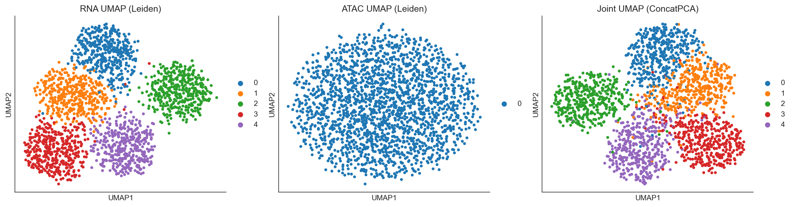

# scCytoTrek Multiome (RNA+ATAC) Demo Report

This report demonstrates the joint analysis of scRNA-seq and scATAC-seq data using `scCytoTrek` and its underlying `mudata` backend.

## 1. Modality-Specific processing and WNN Integration
`scCytoTrek.multiome.run_wnn` processes both modalities and establishes a joint representation of the Multiome data.

## 1.5 Additional Multiome Integration Methods
scCytoTrek also provides wrapper implementations for 5 distinct joint integration modalities:
1. **CCA (Canonical Correlation Analysis)**: Extracts maximally correlated biological subspaces.
2. **Concatenated PCA**: Simple early-fusion dimensionality reduction post-L2 normalization.
3. **Procrustes Alignment**: Rotation, translation, and scaling to overlay cross-modality matrices.
4. **SNF (Similarity Network Fusion)**: Aggregation of kNN adjacency graphs into a consensus network.
5. **Joint Harmony**: Batch-correction mechanism applied natively to the multi-modal space.

Side-by-side comparison of the independent embeddings prior to joint-graph resolution, alongside a Joint Embedding (ConcatPCA).

## 2. Conclusion
The Multiome wrapper successfully manages both AnnData structures within a unified MuData container, allowing parallel modular workflows and cross-modality anchoring.
