# scCytoTrek Demonstration Pipeline

## 1. Data Loading
Loaded `scanpy.datasets.pbmc3k()` dataset: `AnnData object with n_obs × n_vars = 2700 × 32738
    var: 'gene_ids'`

## 2. Preprocessing
We begin by evaluating total molecular distributions (UMI Depth) to remove empty droplets or multi-nucleated aberrations using QC Violin Plots.

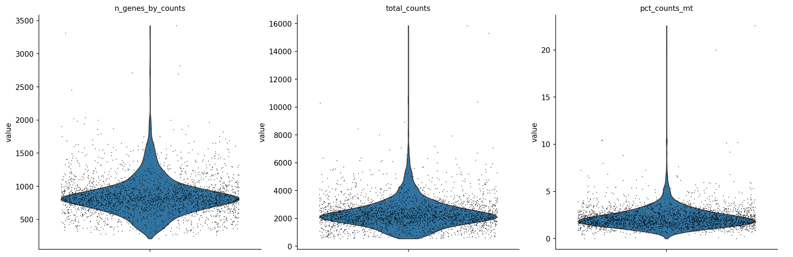

- **Doublet Detection:** Custom kNN-based doublet finding. Identified and removed 140 doublets.
  
  

- **Subsampling:** Subsampled remaining cells for demonstration purposes.
- **Normalization & HVG:** Standard log1p and 1000 highly variable genes selected.

## 3. Dimensionality Reduction
Standard PCA, Neighborhood Graph, and UMAP computation. Leiden clustering (resolution=0.5) is used as the base labeling.

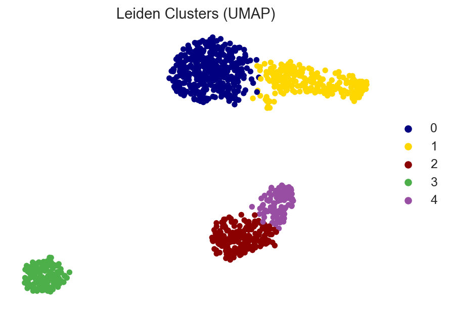

## 3.5 Alternative Clustering Methods
scCytoTrek supports several standard and specialized clustering algorithms. Below is an overview of each method's pros, cons, and ideal working situations:

### 1. K-Means Clustering
- **Pros:** Extremely fast and scalable to massive single-cell datasets. Simple to interpret.
- **Cons:** Assumes spherical clusters of similar size. Fails on complex, elongated trajectory manifolds.
- **Working Situation:** Best used as an initial rapid quantization step or when cell types are highly distinct and globular (e.g., peripheral blood mononuclear cells where major lineages are highly separated).

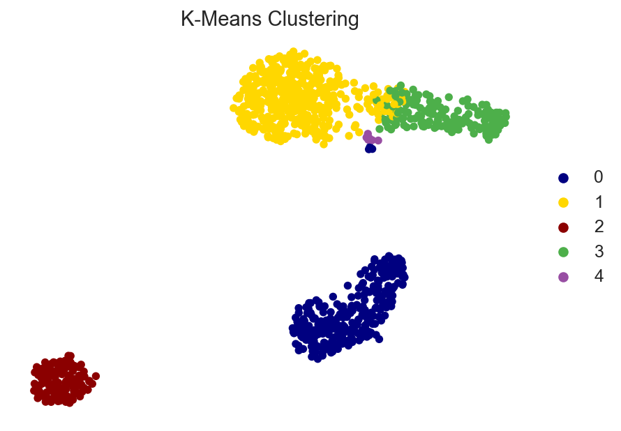

### 2. Agglomerative (Hierarchical) Clustering
- **Pros:** Does not require a pre-specified number of clusters (if a distance threshold is used). Captures hierarchical relationships between cell types (e.g., T-cell subtypes grouping under a pan-T lineage).
- **Cons:** High memory and computational complexity ($O(N^2)$ or $O(N^3)$), making it very slow for datasets > 10,000 cells without subsampling.
- **Working Situation:** Ideal for smaller scRNA-seq datasets or bulk RNA-seq where establishing an evolutionary or developmental relationship between the populations is critical.

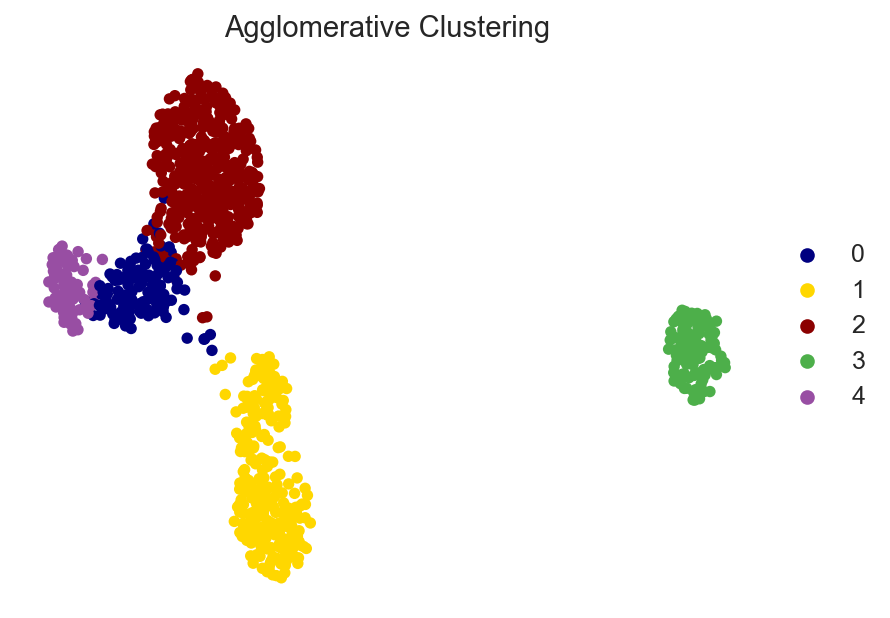

### 5. DBSCAN (Density-Based)
- **Pros:** Does not force every cell into a cluster (can robustly identify noise/outliers). Excellent at finding clusters of arbitrary shape based on local density.
- **Cons:** Extremely sensitive to the `eps` (distance) parameter. Fails if the dataset has vastly different densities across the manifold.
- **Working Situation:** Best for filtering out anomalous/outlier cells or processing spatial transcriptomics where distinct anatomical regions correspond to dense clusters separated by empty space.

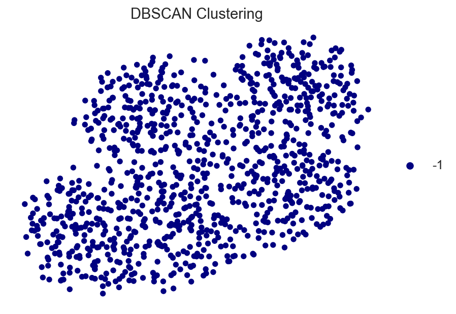

### 6. Louvain Clustering
- **Pros:** Conventional, widely adopted graph-based community detection. Extremely fast and identifies non-linear structural communities effectively.
- **Cons:** Resolution limit problem (can miss small sub-clusters in large datasets).
- **Working Situation:** The standard gold standard for initial general cell-type clustering in most scRNA-seq workflows.

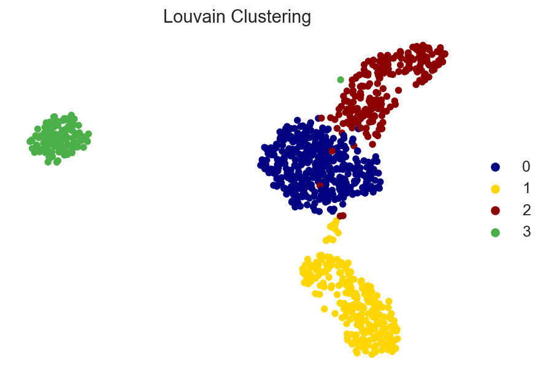

### 7. Leiden Clustering
- **Pros:** An improvement over Louvain. Guarantees well-connected communities and avoids badly connected sub-components within clusters.
- **Cons:** Slightly slower than Louvain depending on implementation.
- **Working Situation:** Highly recommended modern alternative to Louvain for nuanced, robust sub-clustering operations.

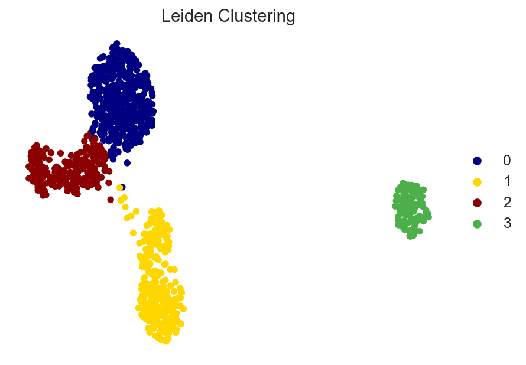

### 3. Trajectory Inference & Streamgraphs
Implemented a suite of trajectory inference engines including **Monocle3**, **Slingshot**, **Palantir**, and **CellRank** approximations to trace cellular development.

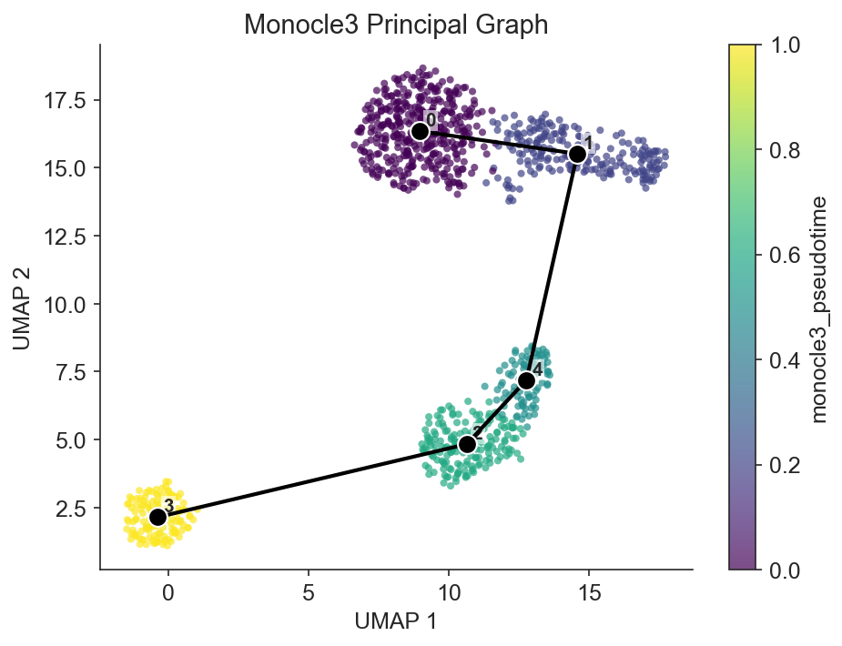

We also provide a **Streamgraph** to visualize the continuous transitions of cell proportions across the pseudotime axis.

Comparison of different pseudotime projections on UMAP:

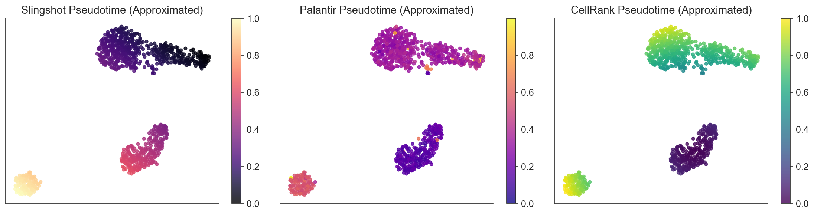

## 4. Cell Type Identification
Assigned cell types based on simple gene module scoring of known markers over cluster consensus.

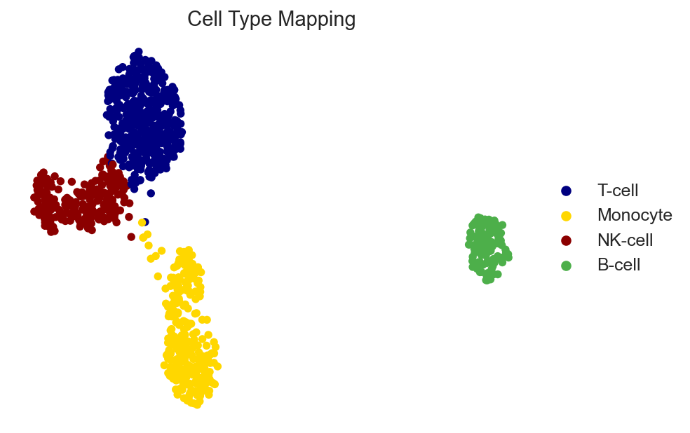

## 5. Differential Expression
Conducted Dropout-Adjusted Differential Expression between `1` and `0`. Results outputted to `differential_expression.csv`.

## 7. Trajectory Inference & Sandpile Entropy
Computed trajectory and Sandpile Network Entropy. Tipping point found at bin 19 with entropy 3.154.

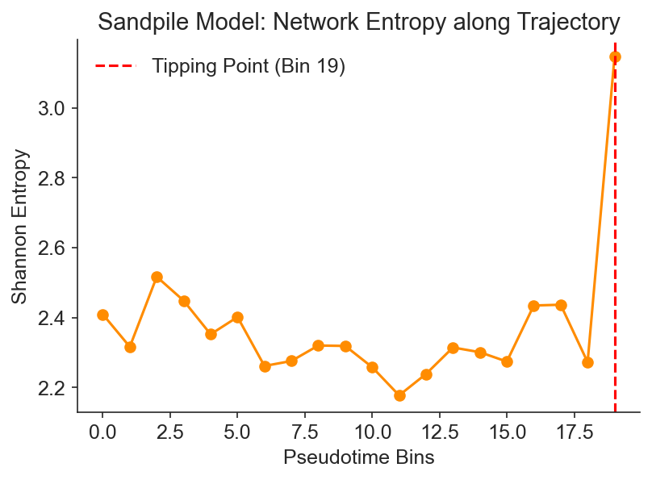

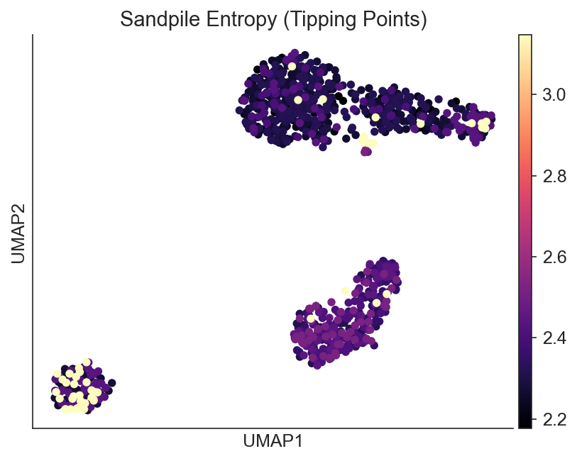

Identified the critical genes driving the network configuration at the tipping point:

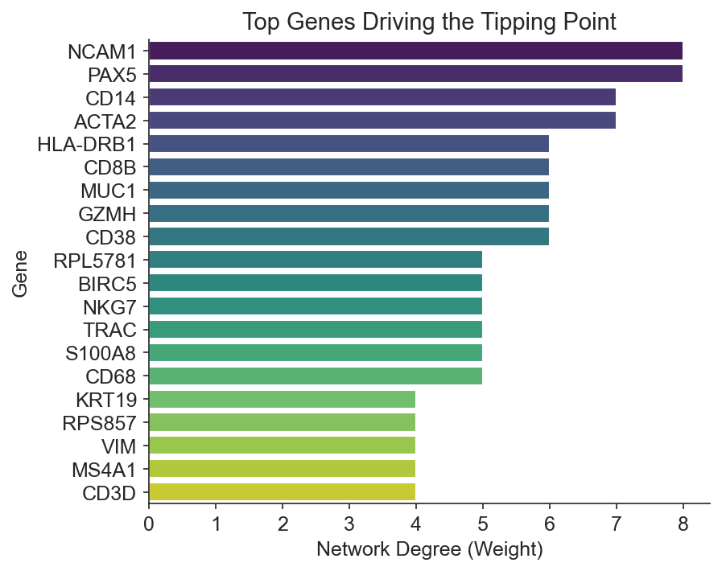

## 6. Transcription Factor Enrichment
Evaluated transcription factor activities using expression-weighted network scoring for `SPI1`.

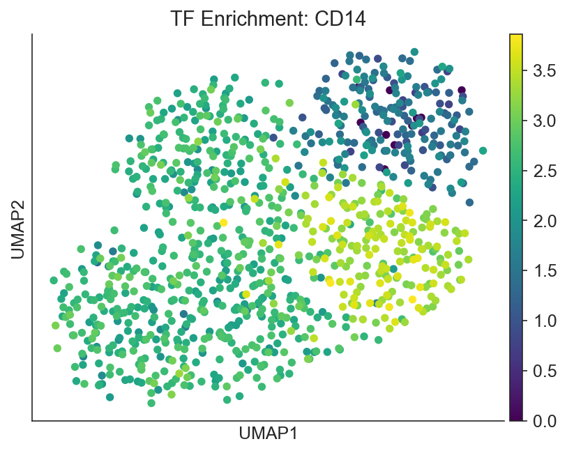

Visualized cluster-specific TF enrichment scores:

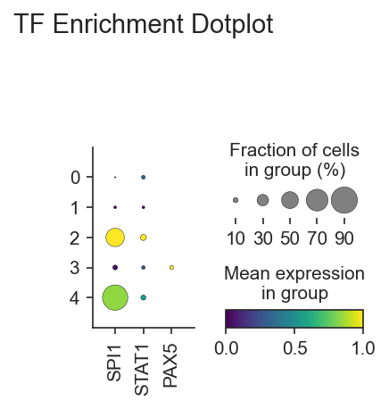

## 8. Pathway Analysis (GSVA)
## 9. Cell-Cell Communication (CellPhoneDB Algorithm & Cell2Cell Plot)
We evaluate extracellular communication by running non-parametric label permutations against biologically relevant immune Ligand-Receptor pairs (e.g., HLA-DRA to CD4, CCL5 to CCR5) on the PBMC data.

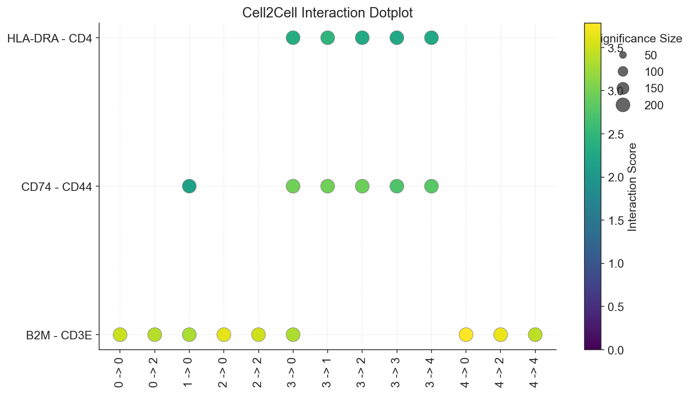

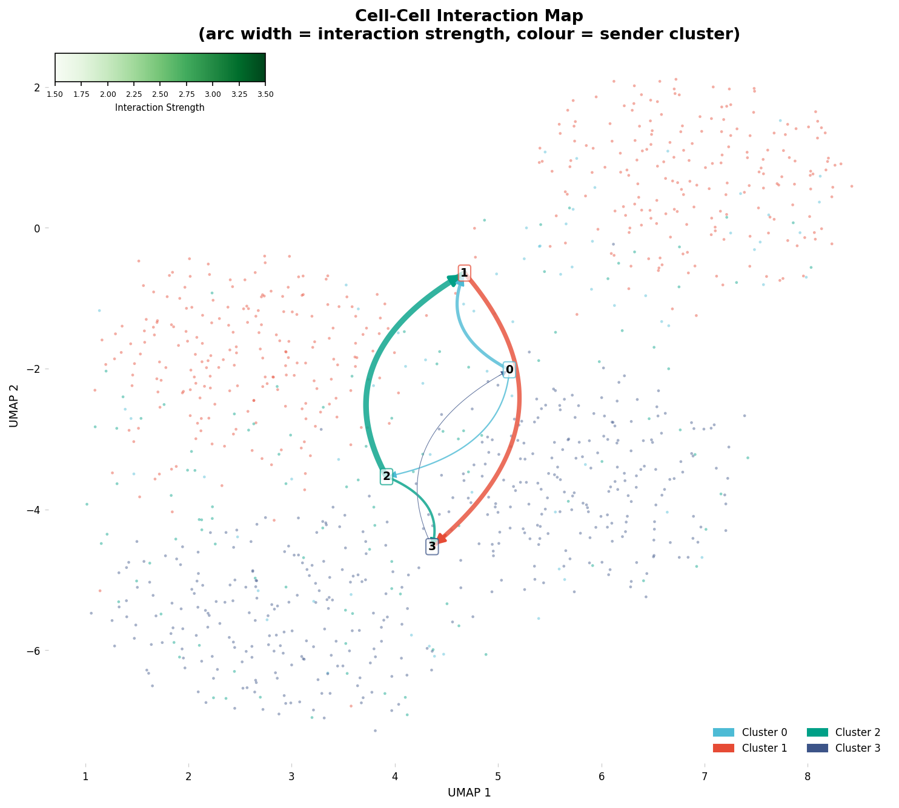

